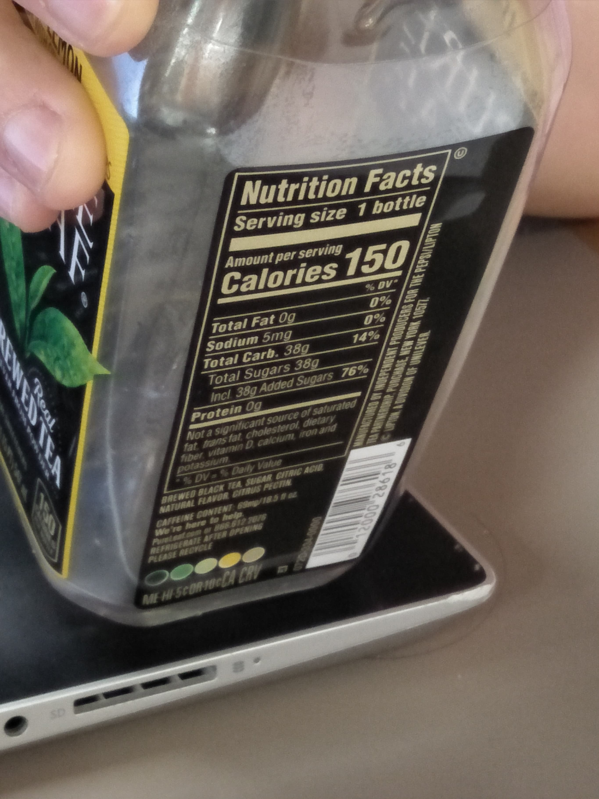
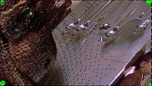

# What is this?

An image resizer algorithm.

## What can it do?

Original image: 


Cut out image:


## How to use

Download the code. Get the image you want to resize in side the same folder as the code. Follow the code. 

Run this in folder containing the file in cmd:
```bash
python click_and_crop.py --image jurassic_park_kitchen.jpg
```


## Contributing
Pull requests are welcome. For major changes, please open an issue first to discuss what you would like to change.

Please make sure to update tests as appropriate.

## License
[Me? I dont know how and why I need licence](https://www.youtube.com/watch?v=dQw4w9WgXcQ)